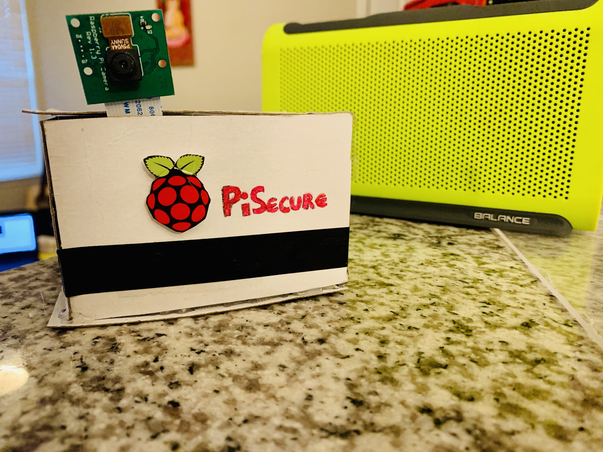

# Pisecure

This project was developed by Omar Zayed and Vanessa Lama. 
We recieved a lot of help from online tutorials offered by pyimagesearch.
This is a raspberry pi, face recognition program that notifies detection with email and annouces it with a speaker.
It also streams to local ip address.

To run the main file:  streamAndFaceRecognition.py --ip 0.0.0.0 --port 8000
Keep in mind the ip address should be the one associated with you raspberry pi.

NOTE: We did not include our model trainer or the datasets in the project.
      You also need to fill in the email information in send_mail.py

      

How to run:
1) add users then run addingUsers.py script
2)  run the trainingTheModel.py
3) run the streamAndFaceRecognition.py as stated above.

Result: 

 

Unknown detection w/ email notification:

 
 

Resources:

https://www.pyimagesearch.com/2018/09/26/install-opencv-4-on-your-raspberry-pi/
https://www.pyimagesearch.com/2017/12/11/image-classification-with-keras-and-deep-learning/
https://www.pyimagesearch.com/2017/10/09/optimizing-opencv-on-the-raspberry-pi/
